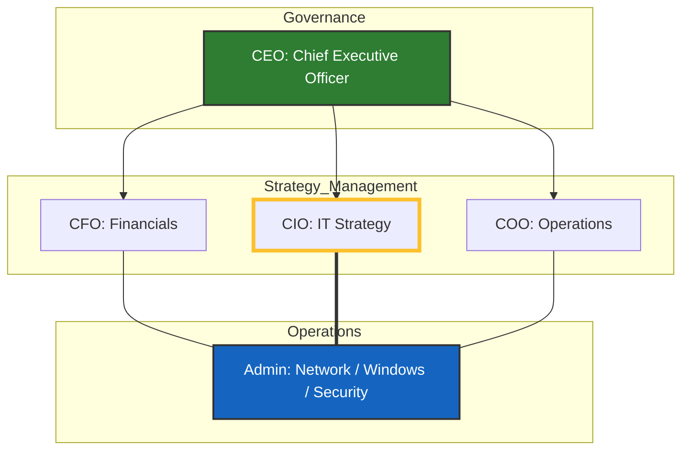
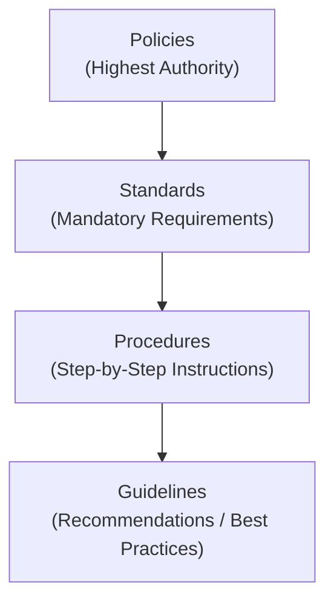

# CISSP
# Domain 01: Security and Risk Managment 

## Domain 01: Security and Risk Management - CIA TRIAD

| Principle | Purpose | Definition | Example |
|-----------|---------|------------|---------|
| **Confidentiality** | Keep data private | Protection from unauthorized access | Encryption, Access controls |
| **Integrity** | Ensure data accuracy | Data remains unaltered | Hashing, Digital signatures |
| **Availability** | Ensure access when needed | Systems/resources are accessible | Redundancy, Load balancing |

### 1. Confidentiality

*Goal: Prevent unauthorized disclosure.*

* **Threats (Your Examples + CISSP Context):**
    - **Social Engineering:** Information leak via social media or "pretexting" (tricking someone into giving up a password).
    - **Keyloggers:** Software or hardware that captures your username/password as you type.
    - **Password Cracking:** Using brute force or "dictionary attacks" to leak out credentials.
    - **Wireless Hacking:** Sniffing traffic on public Wi-Fi to steal device passwords.

* **Solutions:**
    - **Encryption (Data at Rest):** Protecting data stored on a disk (e.g., BitLocker).
    - **Secure Protocols (Data in Motion):** Using **SSL/TLS** or **IPsec** while data is in transit.
    - **Steganography:** Hiding a secret message inside a non-secret file (like a photo).

### Confidentiality Methods

| Method | Purpose | Example |
|--------|---------|---------|
| **Encryption** | Convert data to unreadable format | AES, RSA encryption |
| **Access Controls** | Limit who can access data | IAM, User permissions |
| **2FA** | Additional verification layer | SMS code + password |
| **Data Masking** | Hide specific data fields | Show XXX-XX-1234 for SSN |
---

### 2. Integrity

*Goal: Prevent unauthorized modification. Ensuring data is accurate.*

* **Threats:**
    - **Data Modification:** Intentional (hacking) or accidental (system crash).
    - **XSS or Code Injections:** Malicious code that changes how a website or database behaves.
    - **Encryption Violations:** If an encryption key is compromised, the data can be altered without detection.

* **Solutions:**
     - **Hashing:** Using **MD5** or **SHA-256** to create a unique fingerprint. If the file changes by even 1 bit, the hash changes.
     - **Digital Signatures:** Provides **Integrity** + **Non-repudiation** (proves who sent it).
     - **Parity Bits / Checksums:** Simple methods to check for errors during data transmission.

### Integrity Methods

| Method | Purpose | Example |
|--------|---------|---------|
| **Hashing** | Create data fingerprint | SHA-256 checksums |
| **Digital Signatures** | Verify authenticity + integrity | Signed documents |
| **Checksums** | Verify data transmission | File download verification |
| **Audits** | Review for unauthorized changes | Log analysis |

---

### 3. Availability

*Goal: Ensure timely and reliable access for authorized users.*

* **Threats:**
    - **Malicious Attacks:** **DDoS** (Distributed Denial of Service) to flood a server.
    - **Failures:** Application bugs or hardware crashing (disk failure).
     - **Environmental:** Fires, floods, or power outages.

* **Solutions:**
    - **Redundancy:** **RAID** (multiple disks), **High Availability** (multiple servers/clusters).
    - **SLA (Service Level Agreement):** Contractual uptime requirements.
     - **UPS:** Uninterruptible Power Supply (for power outages).
    - **IPS (Intrusion Prevention System):** To block DDoS traffic.

---
---

## Domain 01: Security and Risk Management - IAAA & Access Control

1. **Identification:** Claiming an identity.
* *Examples:* Username, ID number, SSN. Must be **unique** to the person.

2. **Authentication:** Proving you are who you say you are.
    - **Type 1 (Knowledge):** Something you **know** (Password/PIN).
    - **Type 2 (Ownership):** Something you **have** (Smartcard, Google Authenticator token).
    - **Type 3 (Characteristics):** Something you **are** (Biometrics: Fingerprint, Iris, or **Retina** scan).

3. **Authorization:** What you are allowed to do.
    - **DAC (Discretionary Access Control):** The data owner decides who gets access.
    - **RBAC (Role-Based Access Control):** Access based on your job title.

4. **Accountability:** Proving who did what.
    - **Logs:** Tracking location (e.g., if a user logs in from the US and then 10 minutes later from Asia—an "Impossible Travel" alert).
    - **Digital Signatures:** Prevents a user from saying "It wasn't me." - non-residence 

---

### Subject vs. Object

* **Subject:** The **Active** entity (The User, a Program, a Process).
* **Object:** The **Passive** entity (The File, the Database, the Computer).
* **Rule:** The **Subject** always acts upon the **Object**.

---
---

## Domain 01: Security and Risk Management - Goverance and Management

1. Governance (The "What" and "Why")

* **Definition:** The high-level oversight provided by the Board of Directors and C-Level Executives (CEO, CIO, CTO). They define the "rules of the game" and the ultimate destination for the business.
* **Evaluate – Direct – Monitor:** * **Evaluate:** Look at stakeholder needs and the current environment.
*   **Direct:** Set the strategy and policies that Management must follow.
*   **Monitor:** Check if the organization is actually achieving the goals and following the rules.

* **Organizational Objectives:** They define the "big picture" goals (e.g., "We want to be the #1 provider in Europe").
* **Prioritizing Decision Making:** They decide which projects get funding and which risks are worth taking.
* **Compliance:** Ensuring the company follows legal and regulatory requirements (laws, GDPR, HIPAA, etc.).
* **Risk Appetite:** The amount of risk the organization is *willing* to accept in pursuit of its goals. It can be:
    - **Aggressive:** High risk for high reward.
    - **Neutral:** Balanced approach.
    - **Adverse:** Very cautious; avoiding risk at all costs.

---

2. Management (The "How")

* **Definition:** Led by IT Managers and Directors. They take the "Direction" from Governance and turn it into daily actions.
* **Plan, Build, Run, Monitor:** These are the operational phases. Management plans the project, builds the solution, runs the daily operations, and monitors performance.
* **Executing Instructions:** They don't set the high-level direction; they figure out the best way to get there based on the C-Suite’s orders.
* **Risk Tolerance:** The practical, measurable boundary of risk.
    - *Example:* If Governance has a "Neutral" appetite, Management sets a tolerance (e.g., "We can tolerate a maximum of 2 hours of system downtime per year").
    - They provide feedback to Governance on how these goals affect the team and resources.

---

### Comparison Summary

| Feature | Governance | Management |
| --- | --- | --- |
| **Primary Goal** | Setting the Direction | Achieving the Objectives |
| **Key Question** | "Are we doing the right things?" | "Are we doing things right?" |
| **Risk Term** | **Risk Appetite** (Strategy) | **Risk Tolerance** (Tactical/Limit) |
| **Interaction** | Delegates to Management | Reports to Governance |

---

3. Top-Down Security Management (Recommended)

This is considered the **best practice** because security is treated as a business requirement, not just an IT problem.

* **Who:** Initiated by C-Level Executives (CEO, CIO, CISO) and the Board.
* **How it works:** * Leadership sets the **direction** and signs off on **Enterprise-wide Policies**.
* **Strategic Thinking:** "We had a data breach; we cannot let this happen again. We will now adopt a 'Zero Trust' policy."
* **Support:** Because it comes from the top, there is usually more funding (budget) and higher employee compliance.

* **Why it's better:** It is long-term, consistent, and ensures everyone in the company follows the same rules.

---

4. Bottom-Up Security Management

This is often seen in smaller or less "mature" organizations where the IT team has to "beg" for security improvements.

* **Who:** Junior staff, System Admins, and Network Engineers.
* **How it works:**
* Staff use their daily technical experience to implement security (e.g., an Admin decides to turn on Multi-Factor Authentication because they see a lot of login attacks).
* **The Struggle:** The IT team tries to convince the "C-Level" that security is important, but they often lack the budget or authority to make it company-wide.

* **Why it's risky:** It is often reactive, inconsistent, and lacks the "big picture" of the business goals.

---

## Organizational Structure Table

Based on your diagram at the end, here is how the reporting structure typically looks:

| Level | Role | Responsibility |
| --- | --- | --- |
| **Governance** | **CEO / Board** | Ultimate Accountability & Risk Appetite |
| **Strategy** | **CFO / CIO / COO** | Financials, Infrastructure, and Operations |
| **Tactical** | **IT Managers / CISOs** | Turning policies into project plans |
| **Operational** | **Admins (Net / Win / Sec)** | The "Junior Staff" performing daily tasks |

---

---
---

## Domain 01: Security and Risk Management - Standard and Frameworks

## Control Frameworks

* **PCI-DSS** – Payment Card Industry Data Security Standard
* **OCTAVE** – Operationally Critical Threat Asset & Vulnerability Evaluation (Risk Management)
* **COBIT** – Control Objectives for Information Technology (IT Goals)
* **COSO** – Committee of Sponsoring Organizations (Goals for Organization)
* **ITIL** – Information Technology Infrastructure Library (IT Service Management)
* **FRAP** – Facilitated Risk Analysis Process (Quicker Risk Analysis within Organization)

---

### Comparison of Control Frameworks

| Framework | Full Name | Primary Focus | Best Used For... |
| --- | --- | --- | --- |
| **PCI-DSS** | Payment Card Industry Data Security Standard | **Compliance** | Organizations that handle credit card data. |
| **OCTAVE** | Operationally Critical Threat Asset & Vulnerability Evaluation | **Risk Management** | Identifying assets and evaluating technical vulnerabilities. |
| **COBIT** | Control Objectives for Information Technology | **IT Governance** | Bridging the gap between business goals and IT goals. |
| **COSO** | Committee of Sponsoring Organizations | **Corporate Governance** | High-level financial reporting and internal auditing. |
| **ITIL** | Information Technology Infrastructure Library | **Service Management** | Standardizing IT service delivery (Help Desk, Change Management). |
| **FRAP** | Facilitated Risk Analysis Process | **Risk Assessment** | Quick, qualitative risk analysis for specific projects. |

---

### Key Groupings

It is helpful to see how these work together in a "Top-Down" security model:

1. **Corporate Level (COSO):** The "Big Picture" for the entire company.
2. **IT Governance Level (COBIT):** The strategy for how IT supports that big picture.
3. **Operational Level (ITIL):** The day-to-day "how-to" guide for IT staff.
4. **Specific Compliance (PCI-DSS):** Mandatory rules if you touch money/cards.

---

### ISO Standards List - ISO 27000

- **ISO 27001** – Establish, implement, maintain and improve ISMS (Information Security Management Systems)
- **ISO 27002** – Guidelines to implement SMS and ISMS
- **ISO 27005** – Standards based on health risk management 
- **ISO 27799** – Standards for protected health information 
- **ISO 27004** – Performance evaluation of ISMS 
- **ISO 27005** – Risk management 

---

### Defence in depth
- Layered defence or Onion defence 
- Applied to physical, administrative and logical controls
- Layers of protections 
- Multiple security controls 

---
---

## Domain 01: Security and Risk Management - Intellectual Property

1. **Copyright**
   - Exceptions: first sale, fair use
     - **First sale**: If you bought something, you can sell it the first time, but you must inform the next owner that it is for sale only once, as copyright protects against further sales (for the first owner only). 
     - **Fair use**: If you bought some music and need to use it at home or in the car, you can create multiple copies for personal use only, as you are the single owner. 
   - Applies to books, music, software, media, etc.. 
   - Lifespan: 70 years after creator's death or 95 years from publication.

   - **Privacy issues**: Downloading cracked software falls under illegal copyright infringement. 

2. **Trademark**
   - Logos, brand names, slogans.
   - Trademark lifespan is 10 years, renewable indefinitely. 
   - Fake look-alike brands or names: Products identical with minor modifications fall under intellectual property infringement. 

   **What is virtual property?**  
   Virtual property refers to digital assets in online worlds (e.g., virtual land, items in games like Second Life), treated as intellectual property with ownership rights similar to physical property. 

3. **Patents**
   - Protects inventions for 20 years. 

4. **Trade Secrets**
   - Formulas or business ideas. 
   - Cannot be formally protected like patents, but can be safeguarded under intellectual property laws through NDAs and confidentiality measures. 

5. **Cybersquatting**
   - Registering a domain name in bad faith to profit from a trademark holder's name, often during idea meetings or launches.

6. **Typosquatting**
   - Registering a domain similar to a popular one by exploiting typos.
     Ex: gogle.com instead of google.com. 
---
---

## Domain 01: Security and Risk Management - International Regulations, Laws, and Treaties

---

### 1. Privacy and Data Protection

* **Personally Identifiable Information (PII):** Any data that can be used to distinguish or trace an individual's identity. This must be stored and transmitted securely.
* **Examples:** Location data, credit card numbers, Social Security Numbers (SSN), passport numbers, and biometric records.

* **General Data Protection Regulation (GDPR):** The EU has some of the world's strictest privacy laws. It mandates that organizations provide transparency, data portability, and the "right to be forgotten" for EU citizens.

### 2. US Federal Regulations

* **HIPAA (Health Insurance Portability and Accountability Act):**
* **Focus:** Protects **Protected Health Information (PHI)**.
* **Privacy Rule:** Governs how PHI can be used and disclosed.
* **Security Rule:** Establishes national standards for protecting electronic PHI (ePHI) through administrative, physical, and technical safeguards.

* **GLBA (Gramm-Leach-Bliley Act):** *(Added)* Requires financial institutions to explain their information-sharing practices to customers and to safeguard sensitive data.

### 3. Breach Notification & Privacy Acts

* **Security Breach Notification Laws:**
* Organizations are legally bound to inform users if their sensitive data is leaked.
* **Safe Harbor Exception:** If the data is encrypted (rendering it unreadable to unauthorized parties), many jurisdictions do **not** require a public notification.

* **Electronic Communications Privacy Act (ECPA):**
* **Focus:** Extends government restrictions on wire taps to include the interception of electronic data (emails, mobile phone calls, and stored electronic communications).

* **USA PATRIOT Act of 2001:**
* **Focus:** Electronic monitoring and seizure.
* **Key Detail:** Grants government authorities expanded power to monitor and collect user data without the same level of judicial oversight previously required, specifically for anti-terrorism efforts.

* **Computer Fraud and Abuse Act (CFAA):**
* **Focus:** The primary federal statute used to prosecute hacking and unauthorized access to "protected computers" (including government and financial systems).
* **Scope:** Covers distribution of malicious code, denial of service (DoS) attacks, and trafficking in passwords.

---

### Comparison of US Regulatory Acts

| Act | Primary Focus | Key Data Type |
| --- | --- | --- |
| **HIPAA** | Healthcare Industry | PHI (Protected Health Information) |
| **GLBA** | Financial Industry | PII (Financial Data) |
| **FERPA** | Educational Institutions | Student Records |
| **CFAA** | Anti-Hacking/Unauthorized Access | Any "Protected Computer" |

---
---

## Domain 01: Security and Risk Management - General Data Protection Regulation (GDPR)

The **GDPR** is a comprehensive legal framework on data protection and privacy in the **European Union (EU)** and the **European Economic Area (EEA)**. It also addresses the transfer of personal data outside these areas.

### Financial Penalties (Non-Compliance)

GDPR is famous for its "two-tiered" fine structure. Organizations that fail to comply face the **higher** of the two amounts:

* **Tier 1:** Up to **€10 million** or **2%** of the previous year's total worldwide annual turnover.
* **Tier 2:** Up to **€20 million** or **4%** of the previous year's total worldwide annual turnover (for more serious infringements).

---

### Core Principles & User Rights

1. **Lawful Processing & Restrictions:** Data can only be disclosed under a "lawful basis," such as a **court order** or for criminal investigations. Data must only be used for the specific purpose mentioned at the time of collection.
2. **Right to Access:** Users have the right to obtain a copy of their personal data and understand how it is being processed. Companies are legally bound to provide this upon request.
3. **Right to Erasure (Right to be Forgotten):** Users can request that a company delete their data.
* **Example:** If a user cancels their service with an Internet Service Provider (ISP) and no longer wants their history or personal details stored in the ISP's system.

4. **Data Portability:** Users have the right to receive their data in a structured, commonly used, and machine-readable format to transfer it to another provider.
* **Example:** A patient requesting their digital medical records from one hospital to provide them to a different specialist.

5. **Data Breach Notification:** Organizations must notify the supervisory authority of a data breach within **72 hours** of becoming aware of it.
* **Comparison:** Unlike some US laws where encryption provides a "Safe Harbor" from notification, GDPR requires notification if the breach poses a risk to the individuals' rights and freedoms.

6. **Privacy by Design:** Security and privacy must be integrated into the development of systems and products from the very beginning, rather than added as an afterthought.
7. **Data Protection Officer (DPO):** Certain organizations are mandated to appoint a DPO to oversee data security strategy and GDPR compliance.
* **Requirement:** Mandatory for public authorities, or companies that engage in large-scale systematic monitoring or processing of sensitive personal data.

---

### Key Roles under GDPR

| Role | Responsibility |
| --- | --- |
| **Data Subject** | The individual whose data is being collected (the user). |
| **Data Controller** | The entity that determines the **why** and **how** data is processed. |
| **Data Processor** | The third party that processes data on behalf of the Controller (e.g., a Cloud Provider). |

---
---

## Domain 01: Security and Risk Management – ISC2 Code of Ethics

The CISSP exam expects you to understand the **ISC2 Code of Ethics** at a high level.
While organizations may have their own internal rules, ISC2 provides the core ethical principles that certified professionals must follow.

The official Code of Ethics is provided by ISC2.

---

### The Four Canons of the ISC2 Code of Ethics

#### 1. Protect society, the commonwealth, and the infrastructure

* It is your responsibility to protect critical infrastructure.
* Your actions should never harm society or systems others depend on.
* Security decisions must prioritize public safety and trust.

---

#### 2. Act honorably, honestly, justly, responsibly, and legally

* You must always act with integrity.
* Follow all applicable laws and regulations.
* Do not misuse your access, authority, or privileges.

---

#### 3. Provide diligent and competent service to principals

* Perform your duties professionally and competently.
* Apply security principles properly and effectively.
* Avoid negligence in your responsibilities.

*(Note: “Principals” means your employer, client, or stakeholders.)*

---

#### 4. Advance and protect the profession

* Support the growth and reputation of the cybersecurity profession.
* Mentor others when possible.
* Do not engage in behavior that damages professional credibility.

---

## Example (Keep in Mind for Exam Scenarios)

* ***International Association of Bioethics (IAB)*** certifications provide the highest industry credentials for digital media and advertising professionals.

From an ethics and compliance perspective, examples of violations include:

### Unauthorized Access to Resources or Internet

* Even if you have full system rights, you must not access resources illegally.
* Do not access user data without proper consent or authorization.

### Disruption of Internet Services

* Do not perform actions that disrupt services or prevent others from working.
* Avoid activities that cause denial of service or operational interruption.

### Compromising Integrity of Data

* Do not manipulate, alter, or destroy data without authorization.
* Maintain accuracy and trustworthiness of information.

### Compromising Privacy of Data

* Do not sell or misuse user data.
* Protect confidentiality at all times.

---

### Exam Tip

For CISSP questions:

* Always prioritize **public safety and legal compliance first**.
* If choices conflict, select the one that best protects society and follows ethical principles.
* Ethics questions are about **what you SHOULD do**, not what is technically possible.

- Society → Law → Client → Profession

---
---

## Domain 01: Security and Risk Management – Information Security Governance

### What is an Objective?

An **objective** is a long-term goal aligned with the organization’s **vision and mission**.
It is something measurable that the organization plans to achieve over time.

---

### Governance Planning Levels

#### 1️⃣ Strategic Plan

* Long-term strategy based on the organization’s **vision and mission**.
* Defined at the **executive level** (CEO, Board of Directors).
* Sets overall direction and high-level security goals.

**Example:**

* Become ISO 27001 certified within 3 years.
* Build a zero-trust architecture strategy.

---

#### 2️⃣ Tactical Plan

* Developed after the strategic plan.
* Breaks strategic objectives into actionable components.
* Allocates resources (budget, infrastructure, employees).
* Defines *how* to achieve the strategy.

**Example:**

* Upgrade infrastructure.
* Request security budget approval.
* Hire security engineers.
* Deploy SIEM solution.

---

#### 3️⃣ Operational Plan

* Day-to-day implementation plan.
* Executes tactical decisions at the ground level.
* Defines timelines, procedures, and task execution.

**Example:**

* Schedule vulnerability scans.
* Define testing timelines.
* Monitor implementation progress.

---

### Governance Documentation Hierarchy

---

### 🔺 Think of it as Top-Down Authority:

**Policies → Standards → Procedures → Guidelines**

* **Top (Policies)** = Broad, strategic direction
* **Middle (Standards & Procedures)** = Enforcement + Implementation
* **Bottom (Guidelines)** = Flexible best practices

***For CISSP exam questions:***
- If authority increases → move **up** the pyramid.
- If detail increases → move **down** the pyramid.

---

### [A] Policies

* Formal statements of rules that everyone must follow.
* Mandatory and enforceable.
* Define organizational expectations.

**Examples:**

* Working hours (time in/out).
* Asset usage policy.
* Acceptable use policy.

### Types of Policies

#### 1. Senior Management Policy

* High-level statements.
* Defines objectives, ethics, beliefs, and requirements.
* Approved by senior leadership.

---

#### 2. Regulatory Policy

* Based on federal, state, or industry requirements.
* Mandatory compliance.
* May include frameworks like ISO standards.

Example framework:
International Organization for Standardization (ISO)

---

#### 3. Advisory Policy

* Specifies penalties and consequences for non-compliance.
* Explains disciplinary actions.

Example:

* Failure to follow security policy may result in warnings or termination.

---

#### 4. Informative Policy

* Provides information.
* No mandatory compliance requirement.
* Used for awareness and communication.

---

### [B] Standards

* Specific **mandatory technical requirements**.
* Define baselines.

**Examples:**

* Minimum OS version for company laptops.
* Required RAM/GPU specifications.
* Data center must have firewall and antivirus installed.
* Password length must be at least 12 characters.

👉 Standards support policies.

---

### [C] Procedures

* Step-by-step instructions.
* Explain how to implement policies and standards.
* Very detailed and actionable.

**Example:**

* Steps to onboard a new employee.
* Steps to configure firewall rules.
* Incident response handling steps.

---

### [D] Guidelines

* Recommended best practices.
* Not mandatory.
* Flexible guidance.

**Example:**

* Suggested password manager.
* Recommended encryption methods.

---

### Personnel Security

Personnel security ensures employees and third parties do not become security risks.

---

#### 1️⃣ Awareness

* Focuses on behavior change.
* Targets general employees.
* Integrated into daily activities.

Example:

* Posters about phishing.
* Security reminder emails.

---

#### 2️⃣ Training

* Provides specific skills.
* More in-depth than awareness.
* Role-based.

**Examples:**

* Phishing simulation training.
* Spam email identification training.
* Reward employees who report phishing (motivation strategy).

If many employees click phishing emails → provide specialized re-training.

---

#### 3️⃣ Hiring Practices

* Background checks.
* Credit history review (where legally permitted).
* Social media screening (carefully and lawfully).

Purpose:

* Reduce insider threats.
* Protect employer and client reputation.

---

#### 4️⃣ Employee Termination

* Clearly defined termination and retention policies.
* Progressive discipline process:

  * First warning
  * Second warning
  * Additional training
  * Termination (if required)

Security steps during termination:

* Disable system access immediately.
* Retrieve company assets.
* NDA or non-compete agreements (where legally valid).

---

#### 5️⃣ Consultants (External Entities)

* Must comply with baseline security policies.
* Not full employees but must follow defined controls.
* Access should follow least privilege principle.

---

#### 6️⃣ Outsourcing

* Must follow data protection standards.
* Continuous monitoring required.
* Ensure compliance with contractual security obligations.

Example risk:

* Outsourcing to lower-cost countries without proper data protection controls can increase security and compliance risks.

---

### 🔎 Exam Tips (Very Important for CISSP)

* Governance starts at the **top (Board / Executive level)**.
* Policies are mandatory.
* Standards are mandatory technical requirements.
* Procedures are step-by-step.
* Guidelines are recommendations.
* Strategic → Tactical → Operational (know the order).

---

### Policy vs Standard vs Procedure vs Guideline (CISSP Quick Table)

| Feature                      | Policy            | Standard                   | Procedure                   | Guideline              |
| ---------------------------- | ----------------- | -------------------------- | --------------------------- | ---------------------- |
| **Purpose**                  | High-level rule   | Mandatory requirement      | Step-by-step instruction    | Recommendation         |
| **Level**                    | Strategic         | Tactical                   | Operational                 | Operational            |
| **Mandatory?**               | ✅ Yes             | ✅ Yes                      | ✅ Yes                       | ❌ No                   |
| **Detail Level**             | Broad             | Specific                   | Very detailed               | Flexible               |
| **Audience**                 | Organization-wide | Technical teams            | Operational staff           | Anyone                 |
| **Created By**               | Senior management | Management / Security team | Technical / Operations team | Subject matter experts |
| **Changes Frequently?**      | Rarely            | Occasionally               | Often                       | As needed              |
| **Defines “What” or “How”?** | What              | What specifically          | How                         | Suggested how          |

---

### Easy Way to Remember

* **Policy** → “WHAT must be done”
* **Standard** → “WHAT exactly is required”
* **Procedure** → “HOW to do it”
* **Guideline** → “BEST WAY to do it”

---

### Example (Very Important for Exam)

#### Scenario: Password Protection

**Policy**

> All employees must use strong passwords.

**Standard**

> Passwords must be at least 12 characters, include uppercase, lowercase, number, and special character.

**Procedure**

> Steps to configure password policy in Active Directory:
>
> 1. Open Group Policy
> 2. Navigate to Security Settings
> 3. Set minimum length to 12
> 4. Enable complexity requirement

**Guideline**

> Consider using a password manager to generate complex passwords.

---

### Exam Trap Alerts 🚨

1. If the question mentions **“approved by senior management”** → Likely Policy
2. If it mentions **“baseline configuration”** → Standard
3. If it mentions **“step-by-step instructions”** → Procedure
4. If it mentions **“recommended” or “best practice”** → Guideline

---

### CISSP Memory Trick

**P-S-P-G → “Pretty Smart People Govern”**

Policy → Standard → Procedure → Guideline

(Hierarchy from top authority to lowest)

---
---

## Domain 01: Security and Risk Management – Access Control

### 1. Access Control Models (The "How")

These models define the underlying rules and logic for **how** users are granted access to resources. Think of these as the architectural blueprints.

| Model | Key Feature & Definition | Exam Tip & Example |
| :--- | :--- | :--- |
| **MAC** (Mandatory Access Control) | **LATTICE / LABELS.** Access is determined by the **system** based on security labels (e.g., Confidential, Secret, Top Secret). The data owner *cannot* override these rules. | If the question mentions **Military, Government, or "Confidential/Secret" labels**, the answer is almost always MAC.   *Example:* A user with a "Secret" clearance cannot read a "Top Secret" file, and the owner of that file cannot change those permissions. |
| **DAC** (Discretionary Access Control) | **OWNER decides.** The owner of the resource has total "discretion" to pass permissions to others. | Most flexible but **least secure**. If a user is acting as the "Data Owner," they are operating in a DAC model.   *Example:* This is the default in most OS environments (like Windows or Linux file permissions, where a user can share a folder). |
| **RBAC** (Role-Based Access Control) | **JOB FUNCTION.** Permissions are tied to a specific role or position, not an individual. | Best for high-turnover companies. Prevents "permission creep."   *Example:* A "DB Owner" role has full permissions, while a "DB Reader" role has read-only. When a new employee joins the team, you just assign them the role. |
| **RuBAC** (Rule-Based Access Control) | **IF/THEN logic.** Access is granted based on global, predefined rules or filters. | Often confused with RBAC. Remember: RuBAC is usually a global rule applied to everyone.   *Example:* A firewall rule that says "No traffic allowed from IP 10.0.0.5 after 5 PM." |
| **ABAC** (Attribute-Based Access Control) | **CONTEXT** (Subject, Object, Environmental factors). The most flexible and granular model, using policies that evaluate multiple attributes. | This is the most **complex/detailed** control. If the question asks for the most granular or dynamic control, choose ABAC.   *Example:* An **Auditor** (Subject) can view **Sales Records** (Object) only during **Quarter-End** (Environment) from a **Company Laptop** (Device). |
| **Risk-Based Access Control** | **DYNAMIC ASSESSMENT.** Dynamically assesses the risk level of the access request in real-time. | Think "adaptive authentication." The system changes requirements based on perceived risk.   *Example:* If you log in from the office, you just need a password. If you log in from a foreign country at 3 AM, the system triggers MFA or blocks you entirely. |

> **Exam Tip:** If a question asks who is responsible for assigning user permissions in a **MAC** environment, the answer is the **Administrator/System**, never the user.

### 2. Access Control Categories & Functions (The "What")

This section covers how we classify security controls. The CISSP exam loves to ask you to identify the correct category and function of a specific control.

#### 2.1. Implementation Categories

These are the three "buckets" every control falls into based on how it's implemented.

1.  **Administrative (Managerial):** Think "Paper & People." These are "soft" controls like policies, procedures, background checks, security awareness training, and hiring practices.
2.  **Technical (Logical):** Think "Bits & Bytes." These are "hard" controls implemented via software or hardware, such as firewalls, encryption, passwords, IDS, and ACLs.
3.  **Physical:** Think "Bricks & Mortar." These controls protect the tangible environment, such as fences, locks, guards, dogs, lighting, and CCTV.

#### 2.2. Functional Categories (The "Action")

This describes what the control *does*. A single control can belong to one implementation category and one or more functional categories.

| Type | Purpose | Example |
| :--- | :--- | :--- |
| **Preventive** | Stop an incident from happening. | Firewall, Lock, Encryption, MFA, Fence |
| **Detective** | Identify an incident during or after it occurs. | CCTV, IDS, Security Logs, Motion Sensors, Audits |
| **Corrective** | Fix the system or clean up after a problem. | Antivirus cleaning a file, Applying a patch, Re-imaging a compromised machine |
| **Recovery** | Restore functionality and data after a disaster. | Offsite Backups, Disaster Recovery sites, High Availability (HA) systems |
| **Deterrent** | Discourage a person from even attempting a violation. | Warning signs ("Beware of Dog"), Warning banners on login screens, Fences |
| **Compensating** | A "Plan B" or alternative control used when the primary control is too expensive, complex, or impractical. | Using a security guard to check IDs (compensating) because you can't afford a biometric scanner; using pagers for 2FA if cell phones aren't allowed. |

---

### 3. Critical CISSP "Catch" Questions & Nuances

The exam will test you on the intersection of these concepts.

> **Q: Is a "Warning Banner" on a login screen a Technical or Administrative control?**
> **A:** It is implemented **Technically** (as software), but its legal intent is **Administrative** (to establish policy and consent for monitoring). On the exam, focus on the *primary function*, which is **Deterrent**.

> **Q: Is a Fence a Preventive or Physical control?**
> **A:** It is **both**. It is a **Physical (Category)** control that performs a **Preventive (Function)** . The question may ask for either, so read carefully.

> **Q: How do Least Privilege and Need to Know differ?**
> **A:** This is a classic exam point.
> *   **Least Privilege:** The user is only given the minimum permissions (e.g., Read, Write, Execute) necessary to perform their *job*.
> *   **Need to Know:** Even if a user has the required clearance and the "Read" permission (Least Privilege), they are only allowed to access specific data if it is necessary for their *specific task*. For example, a General with Top Secret clearance doesn't have the "Need to Know" to read every single Top Secret file in the military.

---

### 4. 💡 Pro Exam Tips: The "Secret Sauce"

These high-level tips are crucial for the CISSP mindset.

1.  **"Think Like a Manager":** If a question asks for the "Best" or "First" way to fix a security issue, look for the **Administrative** answer first (Policy, Standard, or Training). You can't fix a human or process problem with a purely technical tool.
2.  **Safety First:** In any CISSP question involving physical security, fire, or evacuations, **Human Life Safety** is always the #1 priority. If an option is "Save the data" and another is "Evacuate the staff," always choose the staff.
3.  **The "Least" Rule:** Always scan the answer choices for **Least Privilege** and **Need to Know**. They are often the correct answer to principle-based questions, especially those involving permissions and data classification.
---
---

## Domain 01: Security and Risk Management – Risk Management

